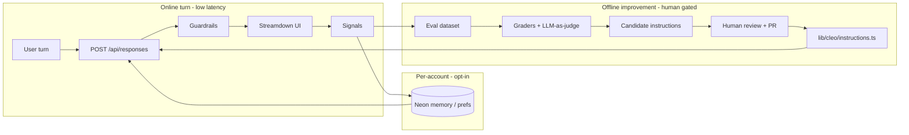

# Self-improving Cleo

Read this when designing feedback, evals, memory, or prompt-evolution loops
for `/cleo`. Runtime chat behavior remains in [`cleo.md`](./cleo.md).

## Goal

Make Cleo improve over time **without** retraining a model and **without**
letting a live turn rewrite production behavior. Improvement means better
instructions, grounded portal answers, and (optionally) per-account
preferences — driven by measurable feedback and human-gated promotion.

This follows the OpenAI [self-evolving agents cookbook](https://developers.openai.com/cookbook/examples/partners/self_evolving_agents/autonomous_agent_retraining):
baseline agent → feedback / graders → eval score → revised prompt → new
baseline. Adapt that loop to Cleo’s invariants; do not port the healthcare
summarizer example literally.

## Non-goals

- Model fine-tuning or weight updates.
- Letting the live `/api/responses` turn mutate `CLEO_INSTRUCTIONS` or catalog
  data.
- Calling a model to author Explore / Space / Civilizations / Cities / Oceans /
  Rivers page prose (still curated; see AGENTS invariants).
- Enabling OpenAI `store: true` without an explicit privacy decision (today:
  `store: false`, browser-held transcript + encrypted reasoning).
- Restoring Upstash, Clerk, admin AMA, or other removed stack without a
  product decision. Prefer **Neon** (already in product) for any durable
  signals.
- Migrating the chat stack to Eve / Agents SDK unless product asks for a
  rewrite. Self-improvement is a **loop around** the existing Responses API
  agent.

## What already helps

| Capability | Where | Role in a self-improving loop |
| --- | --- | --- |
| Strong base instructions | `lib/cleo/instructions.ts` | Baseline “program” to evolve offline |
| Portal catalog grounding | `lib/cleo/portal-catalog.ts` | Deterministic truth for deep links |
| Invented-path / image strip | `lib/cleo/guardrails.ts` | Free deterministic grader signal |
| Topic photo allowlist | `lib/cleo/topic-photos.ts`, `portal-links.ts` | Grounded media checks |
| Adaptive reasoning | `lib/cleo/reasoning-effort.ts` | Cost/quality knob; keep out of auto-prompt soup |
| Signed-in name context | `lib/cleo/user-profile.ts` | Pattern for private per-turn instruction blocks |
| Unit tests | `lib/cleo/*.test.ts` | Regression harness for guardrails & helpers |
| Neon + Better Auth | `docs/auth.md` | Durable store for opt-in signals / prefs |

Live chat is still one-shot generation + stream + post-hoc guardrails. There
is no thumbs feedback, no eval suite, and no durable memory beyond Location
and account name.

## Research: best practices and reference implementations

Surveyed August 2026. Prefer these sources when implementing; do not chase
every research system into the Cleo runtime.

### Canonical references

| Source | Why it matters for Cleo |
| --- | --- |
| [Self-Evolving Agents cookbook](https://developers.openai.com/cookbook/examples/partners/self_evolving_agents/autonomous_agent_retraining) | Baseline → human/LLM feedback → Evals → revised prompt → promote. Compares Platform Optimize, static metaprompt, and GEPA. |
| [Agent improvement loop (traces → evals → Codex)](https://developers.openai.com/cookbook/examples/agents_sdk/agent_improvement_loop) | Production flywheel: traces + human/LLM feedback → reusable evals (Promptfoo) → ranked harness changes → developer handoff. **Reviewed loop first**, deeper automation later. |
| [Working with evals](https://developers.openai.com/api/docs/guides/evals) | Official Evals API: `data_source_config` + `testing_criteria` (graders); template vars for ground truth vs sample output. |
| [GEPA](https://github.com/gepa-ai/gepa) | Reflective prompt/search over execution traces with train/val Pareto selection; used in the OpenAI cookbook and DSPy/MLflow/Opik integrations. |
| [Reflexion (Shinn et al.)](https://arxiv.org/abs/2303.11366) | Actor → Evaluator → verbal Self-Reflection into bounded episodic memory (typically 1–3 lessons). |
| [Anthropic: Building effective agents](https://www.anthropic.com/engineering/building-effective-agents) | Start simple; evaluator-optimizer only when criteria are clear and iteration helps; frameworks optional; measure before adding complexity. |
| [Anthropic: harness design](https://www.anthropic.com/engineering/harness-design-long-running-apps) | Separate skeptical **evaluator** from generator (self-grade is too lenient); re-examine harness when models improve. |
| Mem0 / scoped memory docs | `user_id` / `agent_id` / `run_id` scoping; add/search/update/delete; user-visible deletion. Pattern to copy on Neon — not a required dependency. |

### Practices that consistently show up

1. **Improve the harness, not the weights.** Instructions, tools, validators, and evals are the durable artifacts. OpenAI’s improvement-loop notebook treats the harness as the full contract (prompt + tools + routing + validation). Cleo already has most of that in-repo; evolve it offline.
2. **Grounded evaluators beat self-critique.** Prefer external truth (catalog getters, `guardrails`, tests, tool results) over the generator grading itself. Anthropic and Reflexion both stress this; Cleo’s guardrails are free graders.
3. **Separate generator from evaluator.** Use a distinct rubric/judge (lower temperature / separate call) when you need semantic scores. Cap interactive revise loops (2–3 max); put multi-iteration search offline.
4. **Train vs held-out.** Static metaprompt loops overfit section-by-section feedback. GEPA-style and cookbook guidance: optimize on train, promote only if val improves.
5. **Traces → feedback → evals → change set.** Do not stop at thumbs. Convert failures into reusable cases (Promptfoo or vitest/OpenAI Evals), then a ranked handoff (HALO-style or a short markdown report) for a PR.
6. **Start with Platform Optimize / small golden set**, then automate. Cookbook progression: UI Optimize → scripted graders → GEPA when you need generalization.
7. **Memory is scoped and deletable.** Personal memory ≠ global prompt evolution. Scope by user; expose clear/delete; inject a bounded block; never invent beyond stored notes (aligns with Mem0 scoping and Cleo’s `<cleo_user_profile>` pattern).
8. **Keep the live path simple.** Anthropic: add evaluator-optimizer only when measurable. Cleo’s 90s stream budget favors deterministic sanitize online + rich offline loops.
9. **Human gate until the eval gate is trusted.** OpenAI’s improvement loop default: propose diffs, developer merges. Automate merge only after graders are stable.
10. **Skip RFT / fine-tuning for Cleo.** OpenAI is winding down fine-tuning access for new users; Cleo’s non-goal remains prompt/harness evolution via OpenAI API only.

### Best-fit implementations to borrow (not adopt wholesale)

| Implementation | Borrow | Leave alone for Cleo |
| --- | --- | --- |
| OpenAI Evals Platform + Optimize | Early labeling, thumbs + comment → Optimize on `CLEO_INSTRUCTIONS` draft | Do not make Platform the only source of truth; keep cases in git |
| OpenAI Evals API graders | `string_check` / `score_model` for CI-ish runs | Mirror critical checks in local TS graders that call `guardrails` |
| Promptfoo (from improvement-loop cookbook) | YAML scenarios, regression gate, CI | Optional; vitest may cover Phase A without a new runner |
| GEPA (`gepa-ai/gepa`) | Phase C+ offline instruction search with train/val | Never run GEPA inside `/api/responses` |
| HALO / Codex handoff pattern | Rank harness changes → `codex_handoff.md`-style PR body | No requirement to adopt Agents SDK or HALO dependency |
| Reflexion / Self-Refine | Bounded episodic lessons; offline or rare online repair | No unbounded reflection buffer in the browser transcript |
| Mem0 / Letta-style memory | Scope keys, CRUD, audit history | Prefer Neon tables first; avoid a second memory SaaS unless product asks |
| DSPy / SuperOptiX GEPA adapters | Ideas for persisting optimized instructions as artifacts | Stay on Responses route; no Python agent rewrite |

### Recommended stack for Cleo (research → product)

| Layer | Choice | Rationale |
| --- | --- | --- |
| Online chat | Keep current Responses API + guardrails | Simple, measured, within invariants |
| Online repair | Deterministic sanitize; ≤1 optional repair on hard fail | Latency / `maxDuration` |
| Shared learning | Offline evals → PR to `instructions.ts` | Matches OpenAI + Anthropic “reviewed harness change” |
| Early optimize | OpenAI Platform Optimize on a golden CSV | Fast learning before building GEPA |
| Later optimize | Scripted graders → optional GEPA | Train/val; score report in PR |
| Regression gate | Local deterministic graders (+ optional Promptfoo/OpenAI Evals) | Same truth as production helpers |
| Personal memory | Neon, signed-in, scoped, deletable | Mem0 practices without new vendor |
| Trace capture | Lightweight signals + sampled redacted cases | Improvement-loop “traces” without `store: true` |

## Architecture (three loops)

Use three loops with different trust and latency budgets. Only the offline
loop may change the shared agent.

### 1. Offline self-evolving loop (shared agent)

**Purpose:** Raise baseline quality for everyone.

**Pipeline**

1. **Baseline** — current `CLEO_INSTRUCTIONS` + catalog + tools
   (`web_search`, `image_generation`) as used by `app/api/responses/route.ts`.
2. **Dataset** — curated JSON/CSV of portal-shaped prompts (countries, space
   bodies, civilizations, cities, oceans, rivers, vision, refusal, casual
   chat). Seed from real failure modes (guardrail hits, Retry/Continue,
   invented links), not only happy paths.
3. **Generate** — run the same Responses path in a scripted harness
   (`scripts/cleo/eval-run.mjs` or similar), OpenAI-only, no page rendering.
4. **Grade** — mix deterministic and model graders (see § Graders).
5. **Aggregate** — weighted score; stop when above threshold or `max_retry`.
6. **Reflect / revise** — meta-prompt (or later GEPA-style search) proposes a
   **diff** to instructions; never silent overwrite of `main`.
7. **Promote** — human reviews; land via PR. Update `docs/cleo.md` if
   behavior boundaries change.

**Promotion rule:** Candidate instructions ship only through git review.
Automation may open a draft PR; it must not hot-patch production env vars
with a new system prompt.

Suggested package layout (when implementing):

| Path | Role |
| --- | --- |
| `content/cleo-evals/` or `scripts/cleo/evals/` | Golden cases + expected signals |
| `scripts/cleo/eval-run.mjs` | Batch generate + grade |
| `scripts/cleo/optimize-instructions.mjs` | Offline revise loop (dev/CI only) |
| `lib/cleo/graders/*` | Deterministic graders shared by tests + eval |
| Optional OpenAI Evals UI | Early exploration with thumbs + Optimize |

Start with OpenAI Platform Evals for a small hand-labeled set, then move the
same graders into a repo script so CI can fail regressions.

### 2. Online signals (instrumentation)

**Purpose:** Feed the offline dataset and catch drift. Do **not** auto-rewrite
instructions from a single bad turn.

Collect, with explicit privacy bounds:

| Signal | Source | Why |
| --- | --- | --- |
| Explicit feedback | Optional 👍/👎 + short comment on assistant turns | Human preference text for Optimize / meta-prompt |
| Guardrail strip | Server after sanitize | Invented guide/image paths |
| Incomplete / Retry / Continue | Existing stream `status` + UI actions | Soft failures |
| Cancellation | Client abort | Latency / overlong turns |
| Tool churn | `max_tool_calls` / activity events | Search/image misuse |

**Storage:** Neon tables scoped by `userId` when signed in; for guests either
omit durable storage or store only coarse anonymous aggregates (no raw chat
bodies without consent). Keep raw transcripts out of analytics by default —
store case ids, hashes, grader flags, and short feedback text.

**API sketch:** `POST /api/cleo/feedback` (session-aware), rate-limited like
chat turns. Fail open if Neon is unset (same pattern as auth / Cleo 503
degradation for the rest of the site).

### 3. Per-account memory (personalization, not global learning)

**Purpose:** Remember *this user’s* durable preferences across sessions.

Follow the existing ephemeral-instruction pattern
(`buildUserProfileInstructions` → `<cleo_user_profile>`):

- Opt-in “Remember this” / preference notes for signed-in users only.
- Neon row(s) owned by `user.id`; user-visible and deletable on `/account`.
- Inject a bounded `<cleo_user_memory>` developer block per turn (size-capped).
- Instructions must forbid inventing memories beyond that block (same voice
  rules as name personalization).
- Guests stay browser-only; no cross-device memory.

This is **not** the self-evolving loop. One user’s corrections must not become
everyone’s system prompt without the offline + human path.

## Graders (Cleo-specific)

Prefer cheap deterministic checks before LLM-as-judge.

| Grader | Type | Pass idea |
| --- | --- | --- |
| Guide link validity | Python/TS | Every `/explore|space|civilizations|cities|oceans|rivers/...` link resolves via existing getters |
| No invented curated images | TS | Images match `isCuratedTopicImageSrc` / topic-photo sets when subject matched |
| Guardrail noop | TS | Sanitize did not strip (or strips only on negative cases) |
| Catalog mention | TS | When the gold case expects a deep link, reply contains the canonical path |
| Voice / usefulness | `score_model` | Rubric: lead with answer, no stock phrases, correct register |
| Grounding when searched | `score_model` | Claims that needed `web_search` cite Markdown links |
| Safety / overclaim | `score_model` | No fake personal experience; uncertainty when warranted |

Reuse production helpers (`guardrails.ts`, portal getters) inside graders so
eval truth matches runtime truth.

## Within-turn reflection (optional, capped)

A generate → critique → revise loop **inside** one HTTP request is possible
but expensive under `maxDuration = 90` and streaming UX.

Recommended default:

- Keep **deterministic** post-processing (guardrails) on every turn.
- Add at most **one** silent repair pass when a high-severity grader fails
  (e.g. all guide links invented) **before** finalizing the assistant
  message — only if latency budget allows; otherwise surface Retry/Continue.
- Do not run multi-iteration GEPA-style search on interactive chat.

## Privacy and product boundaries

- `OPENAI_API_KEY` stays server-side; never `NEXT_PUBLIC_`.
- Feedback and memory are server-owned; do not accept client-supplied
  “system prompt overrides”.
- Eval scripts may use the key locally/CI; do not log full prod transcripts
  into third-party eval UIs without redaction.
- Self-improvement must not weaken guardrails to chase a higher judge score.
- Portal pages remain statically authored; the agent improves *answers about*
  the portal, not the portal CMS.

## Implementation phases

### Phase A — Eval harness (ship first)

1. Golden cases for catalog grounding + voice smoke tests (start ~20–30;
   grow from real failures).
2. Deterministic graders wrapping `guardrails` + catalog getters.
3. `pnpm test:cleo-eval` (or vitest) runnable without network for
   deterministic cases; optional live job behind `OPENAI_API_KEY`.
4. Optional parallel: upload the same CSV to OpenAI Evals / Platform Optimize
   for a first instruction revision (manual merge).
5. Document how to add a case when a production failure is found.

### Phase B — Feedback UI + Neon signals

1. Lightweight turn feedback in `components/cleo/*` (design-language: no card
   clutter; one clear control). Prefer rating + short text (feeds Optimize /
   meta-prompt the way the cookbooks expect).
2. Neon schema + `POST /api/cleo/feedback`.
3. Export script: signals → eval case candidates (human triage) — the
   “traces → evals” step from the improvement-loop cookbook.

### Phase C — Offline optimize → PR

1. Scripted meta-prompt revise of `CLEO_INSTRUCTIONS` against failing cases.
2. Score must beat baseline on train **and** held-out cases (anti-overfit).
3. Open draft PR with score report / handoff notes; engineer merges.
4. Later: optional GEPA pass when static metaprompt plateaus.

### Phase D — Opt-in account memory

1. Schema + account UI to view/clear notes (`user_id`-scoped; Mem0-like CRUD).
2. `<cleo_user_memory>` injection + instruction updates in `instructions.ts`
   / `user-profile.ts` pattern.
3. Tests for cap, redaction, and guest isolation.

## Verification bar

| Change | Check |
| --- | --- |
| Graders / harness | Deterministic eval suite green; live eval optional |
| Feedback API | Unit + security tests; rate limit; no secret leakage |
| Memory | Account isolation tests; instruction block size cap |
| Instruction PR from optimize | `pnpm typecheck`, Cleo manual smoke, eval score report attached |
| UI | Desktop/mobile, light/dark; feedback does not block streaming |

## Decision log (defaults)

| Decision | Default |
| --- | --- |
| Where shared learning lands | Git-reviewed `lib/cleo/instructions.ts` |
| Where personal learning lands | Neon, signed-in, opt-in |
| Online auto-prompt update | **No** |
| New infra | Neon only unless product adds another store |
| OpenAI `store` | Stay `false` until privacy review |
| Framework migration | Stay on Responses API route |

When a product decision changes a row above, update this file and the
relevant runbook (`cleo.md` / `auth.md`).
