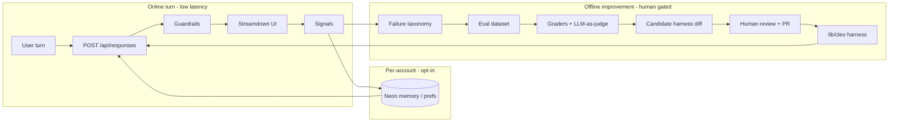

# Self-improving Cleo

Read this when designing feedback, evals, memory, or prompt-evolution loops
for `/cleo`. Runtime chat behavior remains in [`cleo.md`](./cleo.md).

## Goal

Make Cleo improve over time **without** retraining a model and **without**
letting a live turn rewrite production behavior. Improvement means better
**harness** behavior (instructions, tools, validators, routing), grounded
portal answers, and (optionally) per-account preferences — driven by
measurable feedback and human-gated promotion.

This follows the OpenAI [self-evolving agents cookbook](https://developers.openai.com/cookbook/examples/partners/self_evolving_agents/autonomous_agent_retraining)
and the [agent improvement loop](https://developers.openai.com/cookbook/examples/agents_sdk/agent_improvement_loop):
baseline agent → traces / feedback / graders → eval score → revised harness →
new baseline. Adapt those loops to Cleo’s invariants; do not port the
healthcare summarizer or diligence-analyst examples literally.

## Non-goals

- Model fine-tuning or weight updates (OpenAI is winding down fine-tuning
  access for new users; see [RFT](https://developers.openai.com/api/docs/guides/reinforcement-fine-tuning)).
- Letting the live `/api/responses` turn mutate `CLEO_INSTRUCTIONS` or catalog
  data.
- Calling a model to author Explore / Space / Civilizations / Cities / Oceans /
  Rivers page prose (still curated; see AGENTS invariants).
- Enabling OpenAI `store: true` without an explicit privacy decision (today:
  `store: false`, browser-held transcript + encrypted reasoning).
- Restoring Upstash, Clerk, admin AMA, or other removed stack without a
  product decision. Prefer **Neon** (already in product) for any durable
  signals.
- Migrating the chat stack to Eve / Agents SDK unless product asks for a
  rewrite. Self-improvement is a **loop around** the existing Responses API
  agent.
- Building the improvement loop on OpenAI Platform Evals / dataset-backed
  Prompt Optimizer as a durable home (platform deprecation: read-only
  2026-10-31, shutdown 2026-11-30 — see [deprecations](https://developers.openai.com/api/docs/deprecations#2026-06-03-evals-platform)).
  Prefer in-repo graders + Promptfoo / local scripts; Platform UI is optional
  exploration only while it still exists.

## What already helps

| Capability | Where | Role in a self-improving loop |
| --- | --- | --- |
| Strong base instructions | `lib/cleo/instructions.ts` | Baseline “program” to evolve offline |
| Portal catalog grounding | `lib/cleo/portal-catalog.ts` | Deterministic truth for deep links |
| Invented-path / image strip | `lib/cleo/guardrails.ts` | Free deterministic grader signal |
| Topic photo allowlist | `lib/cleo/topic-photos.ts`, `portal-links.ts` | Grounded media checks |
| Adaptive reasoning | `lib/cleo/reasoning-effort.ts` | Cost/quality knob; keep out of auto-prompt soup |
| Tool policy (search / image) | instructions + Responses tools | Part of the harness — evolve with evidence |
| Signed-in name context | `lib/cleo/user-profile.ts` | Pattern for private per-turn instruction blocks |
| Unit tests | `lib/cleo/*.test.ts` | Regression harness for guardrails & helpers |
| Neon + Better Auth | `docs/auth.md` | Durable store for opt-in signals / prefs |
| Sentry | `docs/sentry.md` | Error/latency breadcrumbs; not a transcript store |

Live chat is one-shot generation + stream + post-hoc guardrails, plus the
shipped self-improvement surfaces below (evals, turn feedback, offline
optimize, opt-in account memory).

## Research: best practices and reference implementations

Surveyed August 2026 (re-audited against live OpenAI / Anthropic / GEPA /
Mem0 docs). Prefer these sources when implementing; do not chase every
research system into the Cleo runtime.

### Canonical references

| Source | Why it matters for Cleo |
| --- | --- |
| [Self-Evolving Agents cookbook](https://developers.openai.com/cookbook/examples/partners/self_evolving_agents/autonomous_agent_retraining) | Baseline → human/LLM feedback → graders → revised prompt → promote. Compares Platform Optimize, static metaprompt, and GEPA. Stop criteria (~80% positive / diminishing returns). |
| [Agent improvement loop (traces → evals → Codex)](https://developers.openai.com/cookbook/examples/agents_sdk/agent_improvement_loop) | Production flywheel: traces + human/LLM feedback → reusable evals (Promptfoo) → ranked harness changes (HALO) → developer handoff. **Reviewed loop first**, deeper automation later. Harness = prompt + tools + routing + validation. |
| [Building resilient prompts (evaluation flywheel)](https://developers.openai.com/cookbook/examples/evaluation/building_resilient_prompts_using_an_evaluation_flywheel) | Analyze → Measure → Improve. Open coding → axial coding failure taxonomy; narrow graders per failure mode; judge alignment (TPR/TNR); synthetic tuples for coverage. |
| [Moving from OpenAI Evals to Promptfoo](https://developers.openai.com/cookbook/examples/evaluation/moving-from-openai-evals-to-promptfoo) | Official migration path as Platform Evals shut down. Portable config + CI; recreate custom agent workflows manually. |
| [Working with evals](https://developers.openai.com/api/docs/guides/evals) / [Graders](https://developers.openai.com/api/docs/guides/graders) | Historical API shapes (`data_source_config`, `testing_criteria`, `string_check` / `score_model` / Python). Useful concepts; **do not** depend on the hosted platform past Nov 2026. |
| [Prompt optimizer](https://developers.openai.com/api/docs/guides/prompt-optimizer) | Dense annotations (Good/Bad + critique) beat bare thumbs; narrowly-defined graders; always human-review optimized prompts. Dataset-backed Optimize is part of the Evals deprecation. |
| [GEPA](https://github.com/gepa-ai/gepa) / [optimize_anything](https://gepa-ai.github.io/gepa/blog/2026/02/18/introducing-optimize-anything/) | Reflective prompt/search with train/val Pareto selection; **Actionable Side Information (ASI)** — rich textual feedback, not scalar scores alone. |
| [Reflexion (Shinn et al.)](https://arxiv.org/abs/2303.11366) | Actor → Evaluator → verbal Self-Reflection into bounded episodic memory (typically 1–3 lessons). |
| [Anthropic: Building effective agents](https://www.anthropic.com/engineering/building-effective-agents) | Start simple; evaluator-optimizer only when criteria are clear and iteration helps; frameworks optional; measure before adding complexity; **tool ACI** often matters as much as the system prompt. |
| [Anthropic: harness design](https://www.anthropic.com/engineering/harness-design-long-running-apps) | Separate skeptical **evaluator** from generator (self-grade is too lenient); re-examine harness assumptions when models improve. |
| Mem0 entity-scoped memory | `user_id` / `agent_id` / `app_id` / `run_id` scoping; add/search/update/delete; user-visible deletion; avoid cross-scope leakage. Pattern to copy on Neon — not a required dependency. |

### Practices that consistently show up

1. **Improve the harness, not the weights.** Instructions, tools, validators,
   routing, and evals are the durable artifacts. OpenAI’s improvement-loop
   notebook treats the harness as the full contract. Cleo already has most of
   that in-repo (`instructions.ts`, tool attachment in `/api/responses`,
   `guardrails.ts`); evolve all of it offline — not only the system prompt.
2. **Failure taxonomy before automation.** Open-code ~30–50 failing traces,
   then axial-code into a small set of failure modes (invented links, wrong
   shelf, missing citation, voice/register, overlong search, etc.). Narrow
   graders map 1:1 to those modes ([resilient prompts cookbook](https://developers.openai.com/cookbook/examples/evaluation/building_resilient_prompts_using_an_evaluation_flywheel)).
3. **Grounded evaluators beat self-critique.** Prefer external truth (catalog
   getters, `guardrails`, tests, tool results) over the generator grading
   itself. Anthropic and Reflexion both stress this; Cleo’s guardrails are
   free graders.
4. **Separate generator from evaluator.** Use a distinct rubric/judge (separate
   call / lower temperature) when you need semantic scores. Cap interactive
   revise loops (2–3 max); put multi-iteration search offline.
5. **Align the judge before trusting it.** Measure LLM graders against human
   labels with TPR/TNR on imbalanced data; few-shot clear pass/fail examples;
   hold out a test set so the judge is not overfit ([resilient prompts](https://developers.openai.com/cookbook/examples/evaluation/building_resilient_prompts_using_an_evaluation_flywheel)
   / [graders](https://developers.openai.com/api/docs/guides/graders)). Watch
   for **grader hacking**: high judge scores with low human scores.
6. **Dense annotations beat bare thumbs.** Good/Bad plus a short critique
   (`output_feedback`) is what Optimize / meta-prompt loops actually use.
   Prefer binary pass/fail over fuzzy 1–5 scales when automating.
7. **Train vs held-out.** Static metaprompt loops overfit section-by-section
   feedback. GEPA-style and cookbook guidance: optimize on train, promote only
   if val improves. Keep a blind / production-sampled set for continuous
   monitoring.
8. **Traces → feedback → evals → change set.** Do not stop at thumbs. Convert
   failures into reusable cases (Promptfoo or vitest), then a ranked handoff
   (HALO-style or a short markdown report) for a PR. The improvement-loop
   default is a **reviewed** change set.
9. **Prefer portable evals over hosted Platform Evals.** OpenAI’s migration
   path is Promptfoo; Cleo Phase A should land cases + graders in git first.
   Optional Platform / Datasets exploration is fine only as a short-lived
   bootstrap before the Nov 2026 shutdown.
10. **Memory is scoped and deletable.** Personal memory ≠ global prompt
    evolution. Scope by user; expose clear/delete; inject a bounded block;
    never invent beyond stored notes (Mem0 scoping + Cleo’s
    `<cleo_user_profile>` pattern).
11. **Keep the live path simple.** Anthropic: add evaluator-optimizer only when
    measurable. Cleo’s 90s stream budget favors deterministic sanitize online +
    rich offline loops.
12. **Human gate until the eval gate is trusted.** Propose diffs; developer
    merges. Automate merge only after graders are stable. Self-evolving
    cookbook: stop when quality plateaus or identified failure modes are gone
    (~80% positive feedback as a rough Platform heuristic).
13. **Skip RFT / fine-tuning for Cleo.** Fine-tuning access is winding down for
    new users; stay on prompt/harness evolution via OpenAI API only.
14. **Feed optimizers with ASI, not just scalars.** GEPA and DSPy adapters
    perform better when graders return diagnostic text (what failed, expected
    vs actual, which link was invented). Mirror that in Cleo graders.

### Best-fit implementations to borrow (not adopt wholesale)

| Implementation | Borrow | Leave alone for Cleo |
| --- | --- | --- |
| Promptfoo (+ OpenAI migration cookbook) | YAML/JSON scenarios, assertions, CI gate, red-team later | Do not require Agents SDK; wrap Responses path or grade frozen outputs |
| In-repo vitest / `lib/cleo/graders/*` | Deterministic checks shared with production `guardrails` | Do not duplicate truth in a second language |
| OpenAI Platform Datasets / Optimize | Optional short bootstrap while UI still exists; annotation UX ideas | Not the source of truth after Nov 2026; never the only copy of cases |
| HALO / Codex handoff pattern | Rank harness changes → `codex_handoff.md`-style PR body | No requirement to adopt Agents SDK or HALO dependency |
| GEPA (`gepa-ai/gepa` / `optimize_anything`) | Phase C+ offline instruction (or harness text) search with train/val + ASI | Never run GEPA inside `/api/responses` |
| Reflexion / Self-Refine | Bounded episodic lessons; offline or rare online repair | No unbounded reflection buffer in the browser transcript |
| Mem0 / Letta-style memory | Scope keys, CRUD, audit history, session `run_id` cleanup | Prefer Neon tables first; avoid a second memory SaaS unless product asks |
| DSPy / SuperOptiX GEPA adapters | Ideas for persisting optimized instructions as artifacts | Stay on Responses route; no Python agent rewrite |

### Recommended stack for Cleo (research → product)

| Layer | Choice | Rationale |
| --- | --- | --- |
| Online chat | Keep current Responses API + guardrails | Simple, measured, within invariants |
| Online repair | Deterministic sanitize; ≤1 optional repair on hard fail | Latency / `maxDuration` |
| Shared learning | Offline evals → PR to harness (`instructions.ts`, tools, graders) | Matches OpenAI + Anthropic “reviewed harness change” |
| Durable eval runner | Promptfoo and/or vitest in-repo | Survives Platform Evals shutdown; CI-friendly |
| Early optimize | Manual / meta-prompt revise against failing cases (+ optional Platform Optimize while available) | Fast learning; human merge |
| Later optimize | Scripted graders + optional GEPA with ASI | Train/val; score + feedback report in PR |
| Regression gate | Local deterministic graders first; Promptfoo/LLM judges second | Same truth as production helpers |
| Personal memory | Neon, signed-in, scoped, deletable | Mem0 practices without new vendor |
| Trace capture | Lightweight signals + sampled redacted cases | Improvement-loop “traces” without `store: true` |
| Failure taxonomy | Axial codes in eval case metadata | Graders stay narrow and auditable |

## Architecture (three loops)

Use three loops with different trust and latency budgets. Only the offline
loop may change the shared agent.

### 1. Offline self-evolving loop (shared agent)

**Purpose:** Raise baseline quality for everyone.

**Pipeline**

1. **Baseline** — current harness: `CLEO_INSTRUCTIONS` + catalog + tools
   (`web_search`) + guardrails as used by
   `app/api/responses/route.ts`.
2. **Analyze** — open-code real failures (guardrail hits, Retry/Continue,
   invented links, bad search use); axial-code into a short taxonomy.
3. **Dataset** — curated JSON/CSV/Promptfoo cases for portal-shaped prompts
   (countries, space, civilizations, cities, oceans, rivers, vision, refusal,
   casual chat). Tag each case with failure-mode codes. Seed from failures,
   not only happy paths. Split train / held-out early.
4. **Generate** — run the same Responses path in a scripted harness
   (`scripts/cleo/eval-run.mjs` or Promptfoo custom provider), OpenAI-only, no
   page rendering.
5. **Grade** — mix deterministic and model graders (see § Graders). Prefer
   binary pass/fail + short diagnostic text (ASI) over opaque 1–5 scores.
6. **Aggregate** — weighted score; stop when above threshold or `max_retry`.
7. **Reflect / revise** — meta-prompt (or later GEPA-style search) proposes a
   **diff** to the harness (usually `instructions.ts`, sometimes tool policy
   or guardrails); never silent overwrite of `main`.
8. **Promote** — human reviews; land via PR with score report on train **and**
   held-out. Update `docs/cleo.md` if behavior boundaries change.

**Promotion rule:** Candidate harness changes ship only through git review.
Automation may open a draft PR; it must not hot-patch production env vars
with a new system prompt.

Shipped / planned package layout:

| Path | Role |
| --- | --- |
| `content/cleo-evals/cases.json` | Golden cases + expected signals + failure-mode tags |
| `content/cleo-evals/README.md` | How to add a case from a production failure |
| `lib/cleo/evals/*` | Taxonomy, loader, vitest suite |
| `lib/cleo/graders/*` | Deterministic graders shared by tests + eval |
| `scripts/cleo/optimize-instructions.mjs` | Offline dry-run / live revise loop (`pnpm optimize:cleo`) |
| `lib/cleo/optimize/*` | Scoring, meta-prompt, handoff, promote gate |
| Optional `promptfoo/` config | CI regression / red-team later |
| Optional Platform Datasets UI | Short-lived bootstrap only (deprecated platform) |

### 2. Online signals (instrumentation)

**Purpose:** Feed the offline dataset and catch drift. Do **not** auto-rewrite
instructions from a single bad turn.

Collect, with explicit privacy bounds:

| Signal | Source | Why |
| --- | --- | --- |
| Explicit feedback | Optional 👍/👎 + short comment on assistant turns | Dense human preference text for Optimize / meta-prompt |
| Guardrail strip | Server after sanitize | Invented guide/image paths — free failure-mode labels |
| Incomplete / Retry / Continue | Existing stream `status` + UI actions | Soft failures |
| Cancellation | Client abort | Latency / overlong turns |
| Tool churn | `max_tool_calls` / activity events | Search misuse |
| Sentry errors | Existing SDK | Infra / API failures (no raw chat bodies) |

**Storage:** Neon tables scoped by `userId` when signed in; for guests either
omit durable storage or store only coarse anonymous aggregates (no raw chat
bodies without consent). Keep raw transcripts out of analytics by default —
store case ids, hashes, grader flags, failure-mode codes, and short feedback
text.

**API sketch:** `POST /api/cleo/feedback` (session-aware), rate-limited like
chat turns. Fail open if Neon is unset (same pattern as auth / Cleo 503
degradation for the rest of the site).

### 3. Per-account memory (personalization, not global learning)

**Purpose:** Remember *this user’s* durable preferences across sessions.

Follow the existing ephemeral-instruction pattern
(`buildUserProfileInstructions` → `<cleo_user_profile>`):

- Opt-in “Remember this” / preference notes for signed-in users only.
- Neon row(s) owned by `user.id`; user-visible and deletable on `/account`.
- Inject a bounded `<cleo_user_memory>` developer block per turn (size-capped).
- Instructions must forbid inventing memories beyond that block (same voice
  rules as name personalization).
- Guests stay browser-only; no cross-device memory.
- Optional session scope (`run_id`-style) for temporary notes that expire —
  do not mix into durable user prefs without explicit promote.

This is **not** the self-evolving loop. One user’s corrections must not become
everyone’s system prompt without the offline + human path.

## Graders (Cleo-specific)

Prefer cheap deterministic checks before LLM-as-judge. Return a pass/fail
**and** a short diagnostic string so offline optimizers have ASI.

| Grader | Type | Pass idea |
| --- | --- | --- |
| Guide link validity | TS | Every `/explore\|space\|civilizations\|cities\|oceans\|rivers/...` link resolves via existing getters |
| No invented curated images | TS | Images match `isCuratedTopicImageSrc` / topic-photo sets when subject matched |
| Guardrail noop | TS | Sanitize did not strip (or strips only on negative cases) |
| Catalog mention | TS | When the gold case expects a deep link, reply contains the canonical path |
| Tool policy | TS / activity | Search used only when the case expects it (or not used when forbidden) |
| Voice / usefulness | `score_model` / Promptfoo LLM assert | Rubric: lead with answer, no stock phrases, correct register |
| Grounding when searched | `score_model` | Claims that needed `web_search` cite Markdown links |
| Safety / overclaim | `score_model` | No fake personal experience; uncertainty when warranted |

Reuse production helpers (`guardrails.ts`, portal getters) inside graders so
eval truth matches runtime truth. Before promoting an LLM judge, spot-check
agreement with a human on a labeled slice (aim for high TPR **and** TNR on
failure-finding graders). Do not weaken guardrails to chase a higher judge
score (reward hacking).

## Within-turn reflection (optional, capped)

A generate → critique → revise loop **inside** one HTTP request is possible
but expensive under `maxDuration = 90` and streaming UX.

Recommended default:

- Keep **deterministic** post-processing (guardrails) on every turn.
- Add at most **one** silent repair pass when a high-severity grader fails
  (e.g. all guide links invented) **before** finalizing the assistant
  message — only if latency budget allows; otherwise surface Retry/Continue.
- Do not run multi-iteration GEPA-style search on interactive chat.

## Privacy and product boundaries

- `OPENAI_API_KEY` stays server-side; never `NEXT_PUBLIC_`.
- Feedback and memory are server-owned; do not accept client-supplied
  “system prompt overrides”.
- Eval scripts may use the key locally/CI; do not log full prod transcripts
  into third-party eval UIs without redaction.
- Self-improvement must not weaken guardrails to chase a higher judge score.
- Portal pages remain statically authored; the agent improves *answers about*
  the portal, not the portal CMS.
- Prefer git-owned cases over Platform-only datasets given the Evals
  shutdown timeline.

## Implementation phases

### Phase A — Eval harness (shipped)

In-repo offline harness (no network):

| Piece | Path |
| --- | --- |
| Failure taxonomy | `lib/cleo/evals/taxonomy.ts` |
| Golden cases (train/holdout) | `content/cleo-evals/cases.json` |
| How to add a case | `content/cleo-evals/README.md` |
| Deterministic graders + ASI | `lib/cleo/graders/*` |
| Suite | `pnpm test:cleo-eval` |

Still optional later in Phase A+:

1. Live Responses job behind `OPENAI_API_KEY` for the same case prompts.
2. Short Platform Datasets / Optimize bootstrap **only while available**, then
   copy cases + prompt diff ideas into git (manual merge).

### Phase B — Feedback UI + Neon signals (shipped)

| Piece | Path |
| --- | --- |
| Thumbs + optional note | `components/cleo/message-feedback.tsx` (on completed assistant turns) |
| API | `POST /api/cleo/feedback` — rate-limited; fail-open `{ stored: false }` if Neon unset |
| Schema | `lib/db/cleo-schema.ts` → `cleo_feedback` (`pnpm db:push` when `DATABASE_URL` is set) |
| Parse / hashes | `lib/cleo/feedback.ts` (+ client-safe `feedback-shared.ts`) |
| Export → case candidates | `pnpm export:cleo-feedback` → triage JSON (never auto-merges golden cases) |

Guests may leave feedback (guest key hash, no account id). Rows store capped
excerpts + hashes, not a full analytics transcript warehouse.

### Phase C — Offline optimize → PR (shipped)

| Piece | Path |
| --- | --- |
| Optimize targets filter | `lib/cleo/optimize/targets.ts` (excludes negative detector fixtures) |
| Train/holdout scoring + promote gate | `lib/cleo/optimize/score.ts` |
| Meta-prompt + parse | `lib/cleo/optimize/meta-prompt.ts` |
| Loop | `lib/cleo/optimize/loop.ts` |
| Handoff markdown | `lib/cleo/optimize/handoff.ts` |
| CLI | `pnpm optimize:cleo` (dry-run) / `pnpm optimize:cleo -- --live` |

Promotion rule: candidate pass rate must **strictly** beat baseline on train
**and** holdout. Artifacts land in `tmp/cleo-optimize/` (`handoff.md` +
`candidate-base-instructions.txt`). Apply only via human-reviewed PR to
`CLEO_BASE_INSTRUCTIONS` (catalog stays appended by `buildCleoInstructions`).
Bump `CLEO_PROMPT_CACHE_KEY` when the voice prefix changes enough.

Later optional: GEPA / `optimize_anything` when static metaprompt plateaus.

### Phase D — Opt-in account memory (shipped)

| Piece | Path |
| --- | --- |
| Schema | `lib/db/cleo-schema.ts` → `cleo_memory` (`pnpm db:push` when `DATABASE_URL` is set) |
| Sanitize / inject helpers | `lib/cleo/memory.ts` → `<cleo_user_memory>` (cap 20 notes × 280 chars; block ≤1800) |
| Neon store | `lib/cleo/memory-store.ts` (list/add/delete/clear; fail-open on inject) |
| API | `GET/POST/DELETE /api/cleo/memory` — signed-in only, rate-limited |
| Account UI | `components/account-memory-notes.tsx` on `/account` |
| Chat Remember | `components/cleo/remember-note.tsx` (signed-in; guests see nothing) |
| Injection | `POST /api/responses` loads notes for `session.user.id` into ephemeral developer context |

Guests never get durable memory. One user’s notes never rewrite shared
`CLEO_INSTRUCTIONS` — that stays on the offline + human PR path.

## Verification bar

| Change | Check |
| --- | --- |
| Graders / harness | Deterministic eval suite green; live eval optional; judge spot-check if LLM graders ship |
| Feedback API | Unit + security tests; rate limit; no secret leakage |
| Memory | Account isolation tests; instruction block size cap |
| Instruction / harness PR from optimize | `pnpm typecheck`, Cleo manual smoke, train+held-out score report attached |
| UI | Desktop/mobile, light/dark; feedback does not block streaming |

## Decision log (defaults)

| Decision | Default |
| --- | --- |
| Where shared learning lands | Git-reviewed harness (`lib/cleo/instructions.ts` + related tools/graders) |
| Where personal learning lands | Neon, signed-in, opt-in |
| Online auto-prompt update | **No** |
| Durable eval home | In-repo cases + Promptfoo/vitest (not Platform Evals) |
| Platform Datasets / Optimize | Optional bootstrap only until Nov 2026 shutdown |
| New infra | Neon only unless product adds another store |
| OpenAI `store` | Stay `false` until privacy review |
| Framework migration | Stay on Responses API route |
| Judge promotion | Align to humans (TPR/TNR) before using as a merge gate |

When a product decision changes a row above, update this file and the
relevant runbook (`cleo.md` / `auth.md`).
